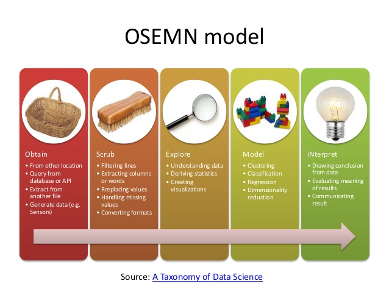
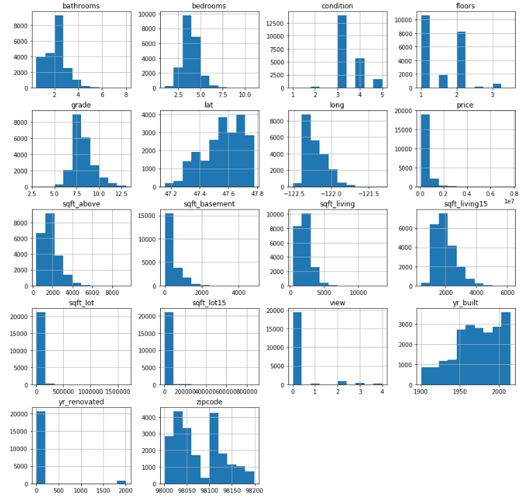
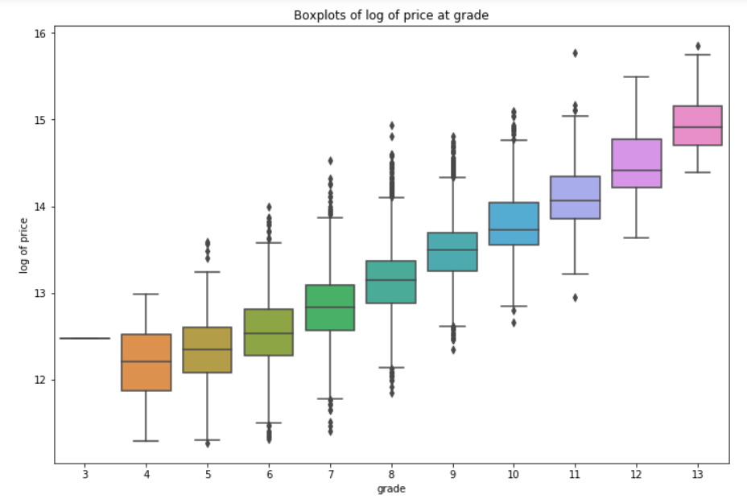
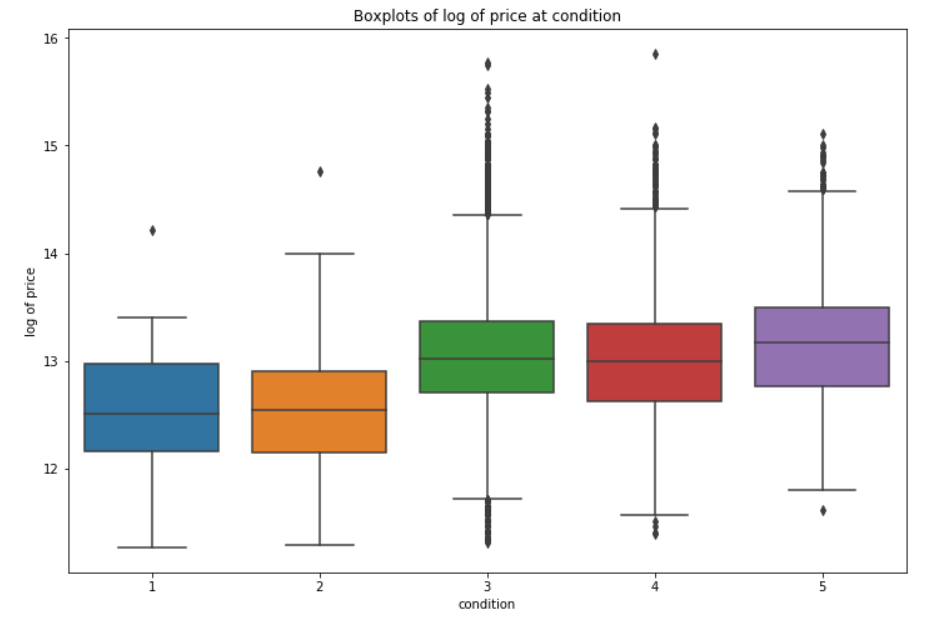
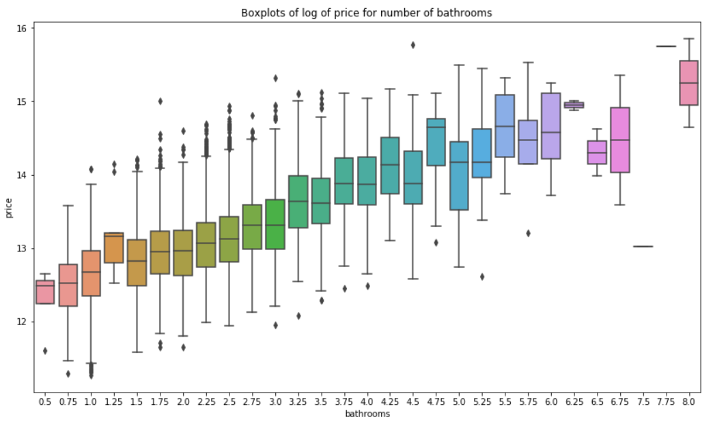
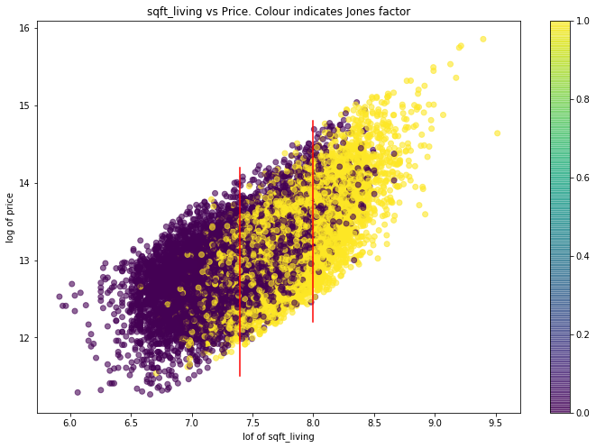
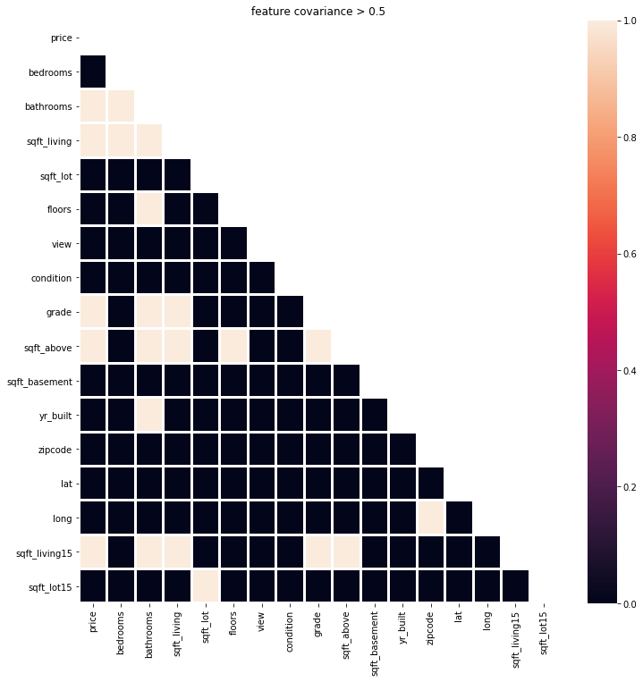
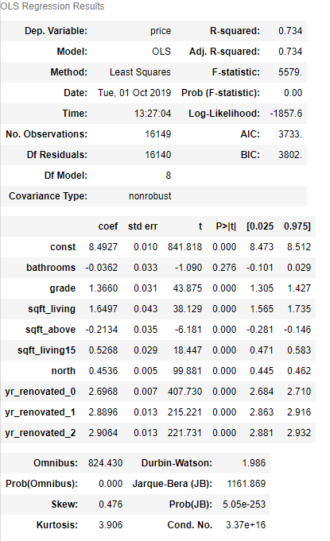
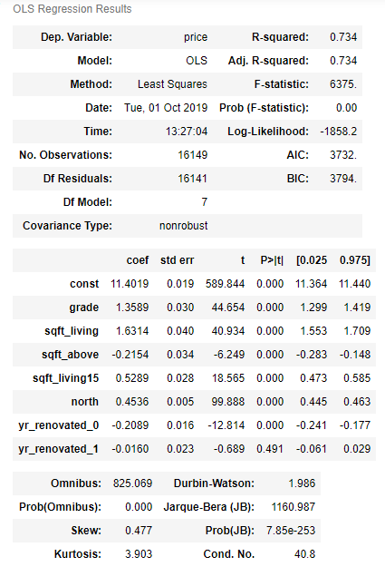

# Kings County Housing Prices - Analysis and Modeling

Full Jupyter Notebook: https://github.com/ktzioumis/Kings-County-Housing-Prices/blob/master/Kings.ipynb

For this project I will be following the OSEMN methodology above:

Obtain: data is provided in the form of 'kc_house_data.csv'. This is loaded directly into a Pandas DataFrame

Scrub: data is checked for missing values and placeholders and outliers

Explore: Exploratory Data Analysis is performed through summary statistics and visually through graphs generated directly from data

Model: Linear Regression model is generated using Ordinary Least Squares method on training split of data set, checked against the test split for variation in Mean Squared Error and verified by 10 fold cross validation 

iNterpret: Conclusions are drawn from the visualizations and from model

## Column Names and descriptions for Kings County Data Set
* **id** - unique identified for a house
* **dateDate** - house was sold
* **pricePrice** -  is prediction target
* **bedroomsNumber** -  of Bedrooms/House
* **bathroomsNumber** -  of bathrooms/bedrooms
* **sqft_livingsquare** -  footage of the home
* **sqft_lotsquare** -  footage of the lot
* **floorsTotal** -  floors (levels) in house
* **waterfront** - House which has a view to a waterfront
* **view** - Has been viewed
* **condition** - How good the condition is ( Overall )
* **grade** - overall grade given to the housing unit, based on King County grading system
* **sqft_above** - square footage of house apart from basement
* **sqft_basement** - square footage of the basement
* **yr_built** - Built Year
* **yr_renovated** - Year when house was renovated
* **zipcode** - zip
* **lat** - Latitude coordinate
* **long** - Longitude coordinate
* **sqft_living15** - The square footage of interior housing living space for the nearest 15 neighbors
* **sqft_lot15** - The square footage of the land lots of the nearest 15 neighbors

## Scrub

**waterfront** - Categorical feature representing whether or not the house is on the waterfront. Very few houses are 1.0. 
Waterfront locations appear to be quite rare, I don't think it is unreasonable to set the missing values to 0 and the data type changed to 'category'

**renovation** - A lot of 0's in the data, these could also be considered missing data as the house cannot have been renovated in the year 0. 0 is a placeholder. Most likely indicating the house has not been renovated since building

**view** - The feature describes the number of times a house has been viewed. There is a 0.0 value that represents the house has not been viewed while it may be the case that the missing data represents house that have not been viewed since there are relatively few pieces of missing data it would be safer to drop these rows than make assumptions that may bias our data set

**sqft_basement** - '?' appears to have been used as placeholder for missing data. There are also a lot of 0's in this data, presumably from houses without basements. From our column descriptions the sqft_basement is the difference between the sqft_living and sqft_above. Replaced with difference between sqft_living and sqft_above. 

## Explore

### House features related to price
                              

Condition of the house matters when it falls below a rank of 3. Efforts to improve the overall condition of the house are worthwhile to raise the condition to 3 but moving beyond a 3 provides little or no added benefit to sale price.
Grade, however, appears to affect sale price at a continuous rate.
Renovating to improve fixtures and architectural detail will continue to improve sale price.
Adding a bathroom is contentious, between 1.5 and 4.25 bathrooms there appears to be a direct positive correlation but past 4.25 bathrooms the effects are less predictable

**Conclusion:** if the house's condition is below a 3 renovate to improve to a 3 past that the renovation budget should focus on improving the house's grade

### Location, Location, Location

A pretty identifiable north/south style divide long the line latitude=47.54
This can be used for our regression model by binning the data by latitude into 'north' and 'south' categories in a feature called 'north'. Expensive (north) will be designated True 

As expected the 'north' split give very distinct numerical descriptions, the mean and median of the more expensive north=1 set are almost double that of the inexpensive north. Although these data sets do overlap, the 75th percentile value of south is below the 25th percentile of the north

### Keeping up with the Joneses

We can't help but compare ourselves to others, especially those nearest to us. This dataset doesn't just provide data about the house itself it also provides interesting information about the houses nearby.
I would expect a house to gain value by being bigger than its neighbors, but does the data show this to be true?
Taking the difference between sqft_living and sqft_living15 determines whether the house in question is bigger or smaller than those around it

The data above paints an unexpected picture. 

Amongst the smallest houses, the houses are almost exclusively smaller than their neighbors and amongst the biggest houses the the houses are almost exclusively bigger than their neighbors. this gives little bases for comparison of similar houses with different neighbor house sizes (varying sqft_living15 where sqft_living is constant).

In the central segment,however, we see a real mix of houses being bigger and smaller than their neighbours for that house size. Surprisingly, what we see are bands at the top and bottom of the price range where the cheaper houses in that size range tend to be bigger than their neighbors and the more expensive house in that size range tend to be smaller than their neighbors! The opposite of my initial assumption!

## Model

The above heatmap makes them really stand out, the 5 linear features are 'bathrooms', 'sqft_living','grade', 'sqft_above','sqft_living15', we also want to include our categorical features from earlier, 'yr_renovated' and 'north'
Modelling assumes normality of features, earlier we had created log transformations on 'price', 'sqft_living', 'sqft_above' and 'sqft_living15', lets bring those transformed versions into our features dataset and perform min-max scaling to have all features normal and between -1 and 1

Data is split into training and test sets using scikit-learn

drop bathrooms from features list as p value is above 0.05 and one categorical column from yr_renovated to avoid dummy variable trap

## Interpret

train MSE: 0.07370008340349138  
test MSE: 0.07417067297395503

10 Fold Cross-Validation

array([-0.07750059, -0.07712413, -0.0760075 , -0.07618568, -0.07070151,
       -0.07337055, -0.07442706, -0.07691479, -0.07601075, -0.0616301 ])

So we have a model! 
R-Squared is 0.733 meaning 73.3% of variation  of the response data and its mean using the features grade, sqft_living, sqft_above, sqft_living15, north and yr_renovated. The features used in the is model were selected by EDA and consistency holds across 10 fold cross validation

## Recap

1. Data loaded into pandas dataframe
2. Data scrubbed for missing values
3. Removed outlier
4. Generated summary statistics and feature histograms
5. Convert yr_renovated to categorical category 
6. EDA to investigate grade, condition and bathrooms
7. EDA to investigate location effects zipcode, lat, long. determine lat 'north' classification feature
8. Take log of price to push to normal distribution
9. Take log of sqft_x features to push to normal where possible
10. Develop, investigate 'jones' feature
11. Check for covariance in heatmap and binary heatmap 
12. Take top 5 linear features using 0.5 corellation with price as cutoff and categorical features to develop regression model
13. min/max scaling on linear features to 
14. one-hot encoding of categorical feature yr_renovated
15. Train/test split
15. OLS regression model.
16. Drop bathrooms from model due to p-value > 0.05
17. Run OLS regression model again
18. Verify model against test data
19. 10 fold cross validation

## Future Work

This model does not make use of the 'date' feature. Future work could involve Exploratory data analysis into whether prices are trending up or down year over year or if the house prices tend to peak or valley during a particular time of year.

Deeper investigation into location data is merited. This report makes a north/south divide but future work could more deeply dive into zipcodes as a method of classification

Investigate internal house ratios. Covariance amongst internal house features such as sqft_living and bedrooms or bathrooms and sqft_above may yield interesting results and trends